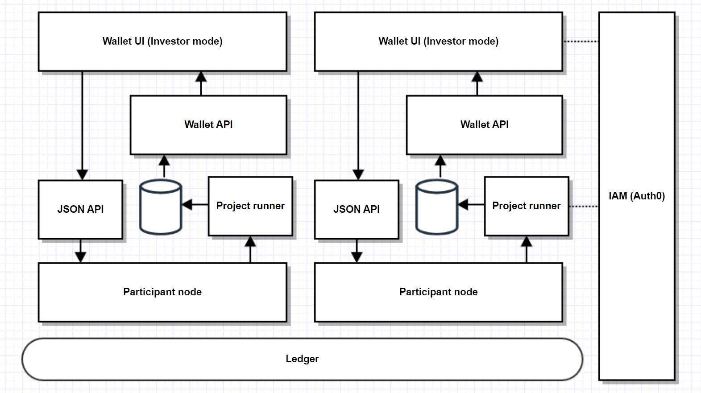

# Daml Tokenization Solution

A solution that demostrates
1. Tokenization of assets using Daml/Canton.
1. Asset settlement on Canton network.
1. Wallet to support the asset tokenization.

## High-level solution design

This diagram shows the overall intended deployment structure of the wallet. Each participant is expected to host their
own instance of the wallet API and wallet UI. The wallet API is read-only, therefore UI users must use the JSON API to
issue any commands which update ledger state. In future this could be migrated to the Daml 3.0 application architecture
in which the wallet application service provider would host the read-only wallet API on their own participant, while
users would submit commands through their participant.



## Components

The project contains a number of components:

| Folder | Content | Dependency |
| ------------- | ------------- | ------------- |
| [models](./models) | Daml templates. Refer to [this readme file](./models/README.md) | Daml Finance |
| demo-config | Configurations files for the initial smart contract setup. The file contains data required to onboard users to the ledger | Daml Finance, Daml templates defined in this project, operations scripts |
| operations | Scripts that support initial contract setup. Refer to [this readme file](./operations/README.md) | Daml Finance, Daml templates defined in this project |
| wallet-views | API for the UI |  |
| wallet-ui | UI app |  |

## Prerequisites

Please follow these prerequisite steps before running any of the build/run/test steps.

Install the following first:

- Daml SDK (https://docs.daml.com/getting-started/installation.html#installing-the-sdk)
- Maven (https://maven.apache.org/install.html)
- sbt (https://www.scala-sbt.org/download.html)
- npm (https://docs.npmjs.com/downloading-and-installing-node-js-and-npm)
- Docker (https://docs.docker.com/get-docker/)

Build has been tested with Java version 17, Maven 3.6.3 and npm 8.19.

Then, clone this repo **including the submodules** which are needed for building:

```bash
git clone https://github.com/SynfiniDLT/daml-tokenization-lib --recurse-submodules
```

The Custom Views library needs to be installed as it is used to continuosly stream events and contracts from the ledger
and store them in a queryable database. In future, this will most likely be replaced with the Daml Participant Query
Store feature. To install Custom Views run:

```bash
make install-custom-views
```

## Asset and party configuration of the demo

This repository comes with a demo which demonstrates how the wallet can be used by both investors and issuers.

### Asset/Account support

1. The demo onboards two issuers, stable coin issuer and fund issuer.
1. The demo supports investors to create account with different asset/coin issuers.
1. The demo supports DvP settlement among asset issuer, investor and broker.

### UI User profile

| UI user profile  | Description  |
| ------------- | -------------  |
| Issuer  | Issuer can create instruments and offers, mint asset and enter into a settlement with other parties. Issuer can access and use the issuer wallet. | 
| Investor  | Investor can accept offers and enter into settlement with other parties. Investor can access and use the investor wallet. | 

### Party configuration

Each user on the ledger needs to use one or many parties to communicate with the ledger to complete the required workflow. 

| User | Party | Description | 
| ------------- | ------------- | -------------  |
| coin issuer | Asset_Issuer | The party manages the coin issuing | 
| coin issuer | Asset_Depository | Depository for the coin instrument | 
| asset/coin validator | Asset_Validator | The party witnesses and validates the transactions on the validator node. The solution supports each asset to have its own validator party. Validator party should be opertated by app operator or ledger provider |
| investor | InvestorA | Investor party |
| investor | InvestorB | Investor party |
| fund issuer | FundA | The party manages the fund issuing |
| fund issuer | Fund_Depository | Depository for the fund instrument |
| broker | FundManagerA | The party which takes the commission in fund settlement workflow | 

## Quick start

You can use the instructions in this section to launch the demo on your local machine.

### Setting up Auth0 Authentication for the React App (Wallet-ui)

This will guide you through the steps to set up Auth0 authentication in your React app as a Single Page Application (SPA). In this application, we leverage Auth0's Universal Login to streamline the authentication and token generation process.   
This authentication service provides a seamless and secure user experience by centralizing login functionality, allowing users to access their blockchain wallet through a unified and authenticated session managed by Auth0.  
The solution currently only supports Auth0, however it could be modified to support other authentication and authorization platform providers if needed.

#### Step 1: Create an Auth0 Account

1. Go to Auth0 and sign up for a free account.
1. Once logged in, go to the Dashboard.
1. Click on the "Create Application" button.
1. Choose "Single Page Web Applications" as the application type.
1. Configure your application settings, including the Allowed Callback URLs, Allowed Logout URLs, and Allowed Web Origins. Typically, for development, you can set these to http://localhost:3000.
1. Save the changes.

#### Step 2: Edit the .env file at the wallet-ui folder with the following: 

```bash
REACT_APP_AUTH0_DOMAIN=your-auth0-domain
REACT_APP_AUTH0_CLIENT_ID=your-auth0-client-id
```
Replace your-auth0-domain and your-auth0-client-id with the values from your Auth0 application settings.

#### Step 3: Create an Auth0 API Resource (Audience)

1. In your Auth0 Dashboard, navigate to the APIs section.
1. Click on the "Create API" button.

1. Fill in the required information:

	Name: Choose a name for your API.
	Identifier (Audience): This is a unique identifier for your API. It can be a URL, such as https://your-api.com.
	Signing Algorithm: RS256 is commonly used.
	Click on the "Create" button to create your API.

	Once the API is created, you'll see the details on the API settings page.

	Take note of the "Identifier" (Audience). This value will be used in your React app to specify the audience when making authentication requests.


1. Update your React app's .env file to include the API Identifier:
```bash
REACT_APP_AUTH0_AUDIENCE=your-api-identifier
```
Replace your-api-identifier with the audience identifier you obtained from the Auth0 Dashboard.

#### Step 4: Edit the users.json File for Ledger Identification

1.	In the ~/demo-config/users folder, there is a users.json file to store user information for ledger identification.
1. The users.json file has an array of user objects, each containing the userId from Auth0 and the corresponding primaryParty for ledger identification. Replace your-auth0-user-id and another-auth0-user-id with the actual user IDs from Auth0.
1. Ensure that the userId in each object corresponds to the sub (subject) field in the Auth0 user profile. You can find the userId in the Auth0 ID Token received during authentication.
1. The primaryParty field is the default party used to issue commands to the ledger. If logged into the UI, the user will act as this party.
1. Save and commit the users.json file to your version control system (e.g., Git) to keep it in sync with your codebase.
1. Whenever a user logs in, retrieve their userId from the Auth0 user profile, and use it to look up the corresponding primaryParty from the users.json file for ledger identification.

This step ensures that your ledger can correctly identify users based on their Auth0 userId and associate them with the appropriate primaryParty. Update your application logic to use this mapping whenever you need to interact with the ledger.


### Start the demo on local sandbox

1. Start a local postgres DB by running: `cd wallet-views/java && docker compose up -d db && cd ../..`
1. Run: `./launch-local-demo.sh`.
1. Start the UI using `make start-wallet-ui`

To stop the demo, press control-C and then run `./kill-local-demo-processes.sh`.

## Build process

TODO: move this somewhere

For front end:

```bash
make build-wallet-ui
```

If the following error occurs
```
  opensslErrorStack: [ 'error:03000086:digital envelope routines::initialization error' ],
  library: 'digital envelope routines',
  reason: 'unsupported',
  code: 'ERR_OSSL_EVP_UNSUPPORTED'

```
Set up the following node option and try again
```
export NODE_OPTIONS=--openssl-legacy-provider
```


To clean the build state:

```bash
make clean
```

## Project Deployment Guide
This guide provides step-by-step instructions for building and deploying the backend and frontend applications using Docker.


### 1. Dockerfile-backend Version Explanation
The Dockerfile-backend uses a version argument that is set in the pom.xml file located at wallet-views/java/pom.xml. This version corresponds to the version of the JAR file used in the backend container.

### 2. Build the Project using Makefile
To build the project, execute the following commands:

``` bash
make build-wallet-views
make build-wallet-ui
```

### 3. Build the Backend Container
Build the backend container by executing the following command. The VERSION argument is used to specify the version of the JAR file from the pom.xml.

```bash
sudo docker build --build-arg VERSION=0.0.2 -t wallet-be -f Dockerfile-backend .
```
### 4. Build the Frontend Container
Build the frontend container using the following command:

```bash
sudo docker build -t wallet-fe -f Dockerfile-frontend .
```

### 5. Run Backend Container
Run the backend container in detached mode, mapping port 8091 on the host to port 8091 in the container:

```bash
sudo docker run -p 8091:8091 --name wallet-backend -d wallet-be
```

### 6. Run Frontend Container
Run the frontend container in detached mode, mapping port 8090 on the host to port 8090 in the container:

```bash
sudo docker run -p 8090:8090 --name wallet-frontend -d wallet-fe
```

### 7. Check Container Logs
Check the logs of the backend container:

```bash
sudo docker logs -f wallet-backend
```


Check the logs of the frontend container:

```bash
sudo docker logs -f wallet-frontend
```

## Next step

There are a number of tasks ahead to complete and enhance this solution. 

1. Update the wallet runer as the custom-views library is deprecated. One option is to upgrade to PQS if the user has Daml Enterprise SDK (https://docs.daml.com/query/pqs-user-guide.html#meet-prerequisites). Another option is to develop a tailored solution to stream data from the ledger to the database. 
1. Use the latest solution from DA to support public party. Public party will enable disclosure such as reference data and public offerings.
