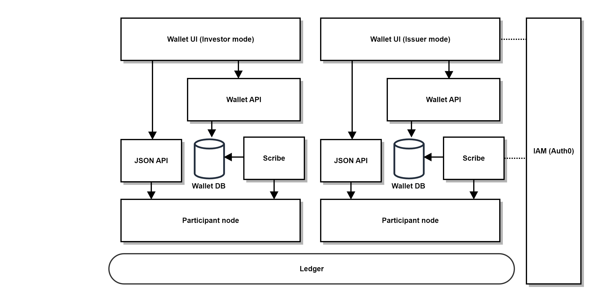
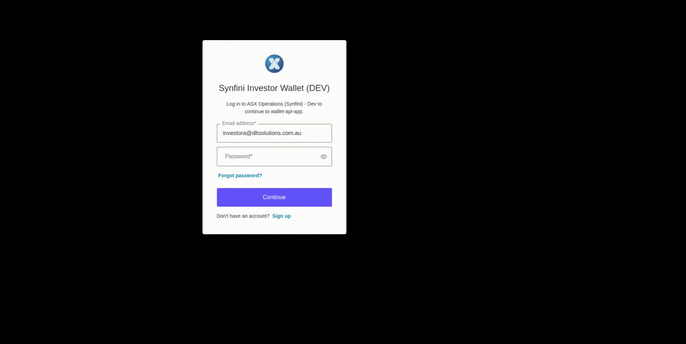
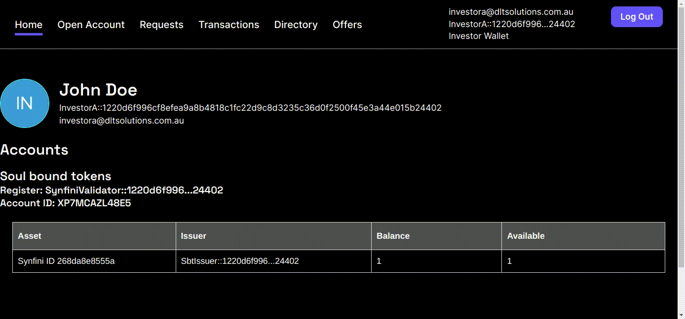
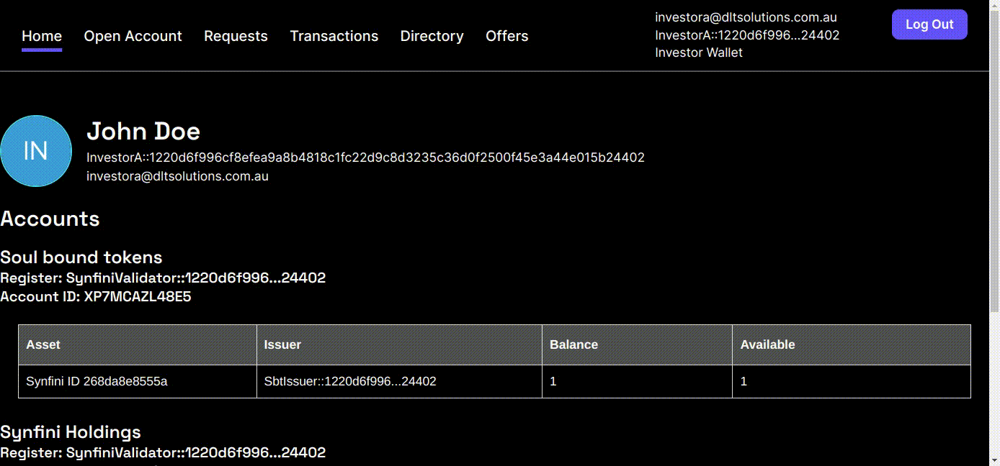
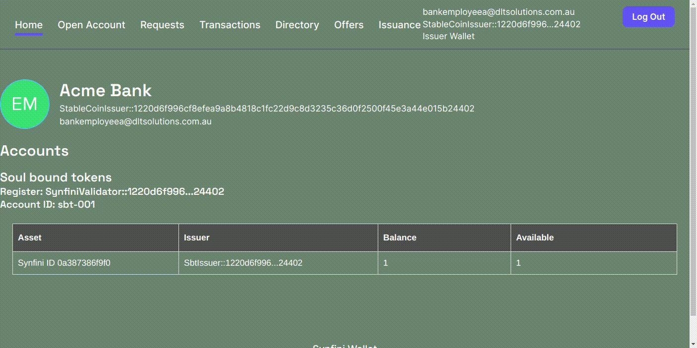
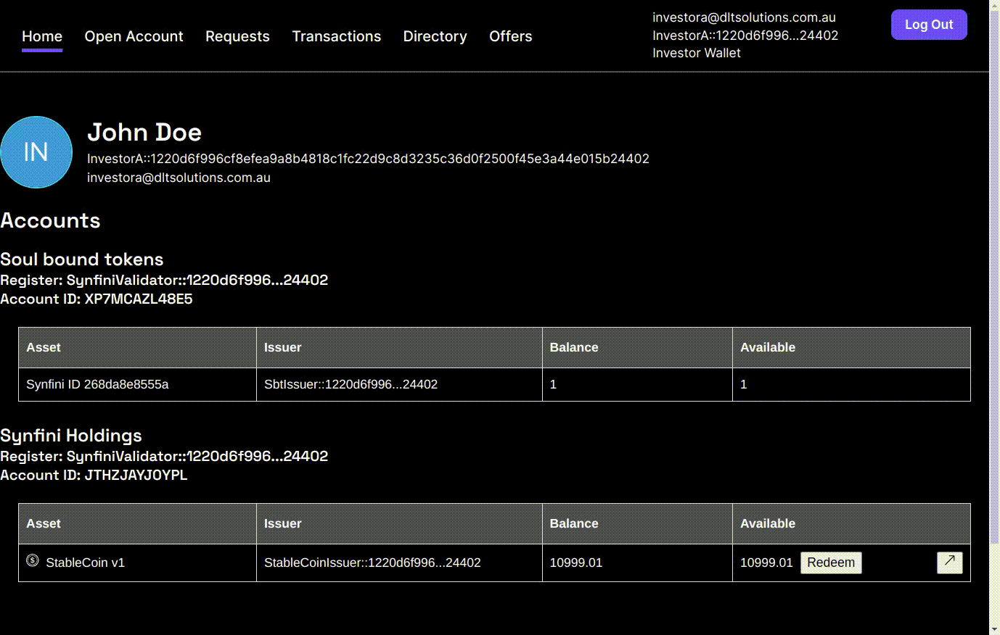

# Daml Tokenization Solution

    Copyright (c) 2024, ASX Operations Pty Ltd. All rights reserved.
    SPDX-License-Identifier: Apache-2.0

A solution that demonstrates
1. Tokenization of assets using Daml/Canton.
1. Asset settlement on Canton network.
1. Wallet to support the asset tokenization.

## High-level solution design

This diagram shows the overall intended deployment structure of the wallet. Each participant is expected to host their
own instance of the wallet API and wallet UI. The wallet API is read-only, therefore UI users must use the JSON API to
issue any commands which update ledger state. In future this could be migrated to the Daml 3.0 application architecture
in which the wallet application service provider would host the read-only wallet API on its participant, while users
would submit commands through their own participants.



It is important to note that this solution is designed to work in congunction with other applications. For example,
there may be another application which implements a customized token with bespoke lifecycling or other functions, but
users could still authorise and complete the settlement processes through the wallet user interface. Due to the fact
that this application makes use of the Daml Finance interfaces (rather than specific implementations), the settlement
instructions can be initiated by a variety of other applications but responded to by users via this solution.

## UI Demonstration

The following examples showcase the functionality provided by the application. One of the primary usecases for this
solution is back office integration, i.e. the backend components and Daml contracts could be consumed by back office
systems and then displayed as desired by the organisation through their own UI. Therefore the UI provided here is only a
basic sample to illustrate what could be achived using the underlying contracts and API.

### Login and Account Setup

The sample UI allows the user to authenticate using Auth0. Once authenticated, the user will be able to issue commands
via the JSON API to their participant node using their primary party. They can also read data from the wallet views API.
Once logged in, the user can see the Daml Finance accounts and assets they own. In the below example, the user has one
non-transferable asset - their "soul-bound token" (SBT). This is a special type of asset issued to the investor which
assigns them a human-readable name so that others can identify them. Clicking on the asset name brings up detailed
information about the asset which they hold - taken from the `Instrument` and
[`Metadata`](./models/instrument-metadata/interface/src/Synfini/Interface/Instrument/Metadata/Metadata.daml) contracts.
 


The user can see both their total balance as well as their available balance - the latter being equal to the total
balance minus the sum of any `Holding` contracts which are locked. As shown above, the user can also view transactions
(Daml Finance settlements) for their accounts. In this case we have one transaction in which the user was issued the
soul-bound token. Each transaction is implemented using the settlement `Batch` workflow provided by Daml Finance.

The user can open new Daml Finance accounts to hold other types of assets. They are provided non-consuming choices to
create new accounts with the given custodian. In this example they create an account for transferable, fungible assets:



In this UI, custodian is referred to as "register". This party is responsible for keeping a register of ownership of an
asset. They onboard investors and issuers but do not play an active role in the settlement workflows. Their other
primary responsibility is operating their participant node which must provide confirmations for all transactions on
their register. There is nothing to stop this application allowing the investor to use multiple custodians/registers to
hold their assets, as all interactions the user has go via their own participant, not the custodians'.

### Asset issuance and settlement

Through the Offers tab the user has the ability to take up settlement offers provided by the asset issuers or other
parties. These offers are open up until such time as the signatories off the
[`OpenOffer`](./models/settlement/open-offer-interface/src/Synfini/Interface/Settlement/OpenOffer/OpenOffer.daml) contract
choose to archive it. The `OpenOffer`s are not restricted to any particular type of settlement. Depending on the payload
of the `OpenOffer` any Daml Finance settlement `Batch` and `Instruction`(s) can be created. In the following example,
a stablecoin issuer has provided an `OpenOffer` for the investors through which they can request issuance of the
stablecoin - assuming the issuer has implemented an off-ledger payment process triggered by the generation of the
settlement instruction.



The user can input a quantity of the asset. The `OpenOffer` payload can (optionally) specify an increment size - in this
case cents are the smallest increment. Upon submitting the form, an exercise command id submitted to the ledger API to
exercise the `Take` choice on the `OpenOffer`, resulting in the creation of the settlement `Instruction`s. The
settlement `Instruction`s then require response from the investor and issuer in order to execute the settlement.

The stablecoin issuer also sees the same transaction and can respond to it. In this case, in order to settle they must
elect to create a new `Holding` and issue it to the investor - as is done below. In this case, the register/custodian
has created a
[`MinterBurner`](./models/issuer-onboarding/minter-burner-interface/src/Synfini/Interface/Onboarding/Issuer/MinterBurner/MinterBurner.daml)
contract to delegate the ability to create the `Holding` to the issuer. After both issuer and investor have selected
their preferences, any of the settlers can click the execute button to perform the settlement.



Finally, the settled transaction and updated balance is visible to the investor:



### Bespoke settlements

This application is designed can complement other applications. Various contracts, such as the settlement `OpenOffer`s
shown previously, could be generated by other usecase-specific applications (such as a stablecoin application or a
fund application) and then responded to by the users using the wallet. The exact details of how such contract are
created is left out of this project. Alternatively, a single end-to-end application could also be developed with all
desired functionality which may simplify the process for the users, but limit options for the users to engage in other
applications.

For example, here we have a 3-way settlement between fund issuer, fund manager and investor, in which the fund manager
receives a comission payment from the investor:


The user can select different accounts for each settlement `Instruction` if required. Upon applying the account
prefences, the user pledges their `Holding`s for the settlement and the available balances on their account(s) will
decrease accordingly.

The fund manager can then view and respond to the settlement instruction:


Finally, the fund issuer can execute the settlement:

[Execute fund issuance](https://github.com/SynfiniDLT/daml-tokenization-toolkit/assets/18343245/47898c9a-9dcf-44d7-a8aa-5a907ccf53d6)

### Secondary market transactions

The application also allows users to engage in secondary market transactions with other users. The simplest example is
a free-of-payment transfer. First, the sender must instruct the settlement for this:

[Instruct transfer](https://github.com/SynfiniDLT/daml-tokenization-toolkit/assets/18343245/2a499afc-fdc8-425e-86b5-fa3c57e5195e)

Note that the sender must enter the full party ID of the receiver but in future this could be made easier using an SBT
to identify the counter party. Next, the receiver can choose to accept the transaction:

[Execute transfer](https://github.com/SynfiniDLT/daml-tokenization-toolkit/assets/18343245/e31ac0ad-e09d-4a86-beaf-87fa23f6cd74)

The application also has a "requests" tab where users can see any outstanding settlement
[`OneTimeOffer`s](./models/settlement/one-time-offer-interface/src/Synfini/Interface/Settlement/OneTimeOffer/OneTimeOffer.daml).
The settlement `OneTimeOffer` contracts are similiar to the `OpenOffer` contracts except that they can only be used
once. It is possible to use a `OneTimeOffer` to propose a Delivery-versus-Payment (DvP) transaction with another party.
In the example below, InvestorB accepts an offer from InvestorA and selects their account preferences. Subsequently,
InvestorA would then need to apply their prefences and the settlement can be executed in the same way as has been
demonstrated in the previous examples.

[Accept DvP Request](https://github.com/SynfiniDLT/daml-tokenization-toolkit/assets/18343245/00badd42-6d28-4531-9545-f3b4ebca753d)

As with the `OpenOffer`, a `OneTimeOffer` can be used to instruct any type of settlement desired by altering the
contract payload.

## Components

The project contains a number of components:

| Folder | Content | Dependency |
| ------------- | ------------- | ------------- |
| [models](./models) | Daml templates used in this project | Daml Finance |
| [demo-config](./demo-config) | Configurations files for the initial smart contract setup. The file contains data required to onboard users to the ledger | Daml Finance, Daml templates defined in this project, operations scripts |
| [operations](./operations) | Scripts that support party and contract setup, instruction and execution of settlements | Daml Finance, Daml templates defined in this project |
| [wallet-views](./wallet-views) | API for the UI | Daml Finance, Daml templates from [models](./models) |
| [wallet-ui](./wallet-ui) | UI app | Daml Finance, Daml templates from [models](./models) |

## Prerequisites

Please follow these prerequisite steps before running any of the build/run/test steps.

Install the following first:

- [Daml SDK](https://docs.daml.com/getting-started/installation.html#installing-the-sdk)
- [Maven](https://maven.apache.org/install.html)
- [npm](https://docs.npmjs.com/downloading-and-installing-node-js-and-npm)
- [Docker](https://docs.docker.com/get-docker/)
- [jq](https://jqlang.github.io/jq/)
- [Python 3](https://www.python.org) (only needed for running the demo)
- [Participant Query Store (PQS)](https://docs.daml.com/2.8.3/query/pqs-user-guide.html) (See the instructions below)

Download the Scribe component (JAR file) of PQS. You will need
a Daml Enterprise license in order to access this. Save it to your machine and export the absolute path to the file
in your terminal envionment using the variable `SCRIBE_LOCATION`. Using a component which requires an enterprise
license is somewhat of a limitation but there are few alternatives other than writing a custom component for this
purpose. For reference, the previous version of this project was implemented without need for the enterprise license
using the (now deprecated) Custom Views library, and can be found
[here](https://github.com/SynfiniDLT/daml-tokenization-toolkit/releases/tag/v0.2.0).

Build has been tested with Java version 17, Maven 3.6.3, npm 8.19 and PQS 2.8.0.

## Asset and party configuration of the demo

This repository comes with a demo which demonstrates how the wallet can be used by investors, issuers and other parties.

### Asset/Account support

1. The demo onboards multiple issuers: a stable coin issuer, a fund issuer, an ESG asset issuer and a "Soul-bound token"
issuer.
1. The demo supports investors to create multiple accounts through offer contracts created by the custodian.
1. The demo supports DvP settlements amongst asset issuer, investor and other parties.

### UI User profile

There are two ways to run the run the UI based on the below user profiles.

| UI user profile  | Description  |
| ------------- | -------------  |
| Issuer | Issuer can create instruments and offers, mint assets and enter into a settlement with other parties. Issuer can access and use the issuer wallet. | 
| Investor | Investor can accept offers and enter into settlement with other parties. Investor can access and use the investor wallet. | 

### Party configuration

Each user on the ledger needs to use one or many parties to communicate with the ledger to complete the required workflow. 

| UI user profile | Primary Party | Description | 
| ------------- | ------------- | -------------  |
| Issuer | StableCoinIssuer | The party manages stablecoin issuing | 
| Issuer | StableCoinDepository | Depository for the stablecoin instrument |
| Issuer | SbtIssuer | The party manages party/soul-bound token issuing | 
| Issuer | SbtDepository | Depository for the party/soul-bound token instrument | 
| Issuer | FundA | The party manages the fund issuing |
| N/A (UI login not required) | FundDepository | Depository for the fund instrument |
| Investor | FundManagerA | The party which takes the commission in fund settlement workflow |
| Issuer | EnvironmentalTokenIssuer | The party manages issuance of environmental tokens |
| N/A (UI login not required) | EnvironmentalTokenDepository | Depository for the environmental token instruments |
| Investor | ProducerA | Producer of environmentally-friendly products/projects, who can be awarded points by the EnvironmentalTokenIssuer |
| N/A (UI login not required) | SynfiniValidator | This party witnesses and validates the movements of assets (act as custodian in Daml Finance). They delegate responsibility for minting/burning `Holding`s to the asset issuers |
| Investor | InvestorA | Investor party |
| Investor | InvestorB | Investor party |

## Quick start

You can use the instructions in this section to launch the demo on your local machine on a single participant node
(Daml sandbox).

### Setting up Auth0 Authentication for the React App (Wallet-ui)

This will guide you through the steps to set up Auth0 authentication in your React app as a Single Page Application (SPA). In this application, we leverage Auth0's Universal Login to streamline the authentication and token generation process.   
This authentication service provides a seamless and secure user experience by centralizing login functionality, allowing users to access their blockchain wallet through a unified and authenticated session managed by Auth0.  
The solution currently only supports Auth0, however it could be modified to support other authentication and authorization platform providers if needed.

#### Step 1: Create an Auth0 Account

1. Go to Auth0 and sign up for a free account.
1. Once logged in, go to the Dashboard.
1. Click on the "Create Application" button.
1. Choose "Single Page Web Applications" as the application type.
1. Configure your application settings, including the Allowed Callback URLs, Allowed Logout URLs, and Allowed Web Origins. Typically, for development, you can set these to http://localhost:3000.
1. Save the changes.

#### Step 2: Edit the .env file at the wallet-ui folder with the following: 

```bash
REACT_APP_AUTH0_DOMAIN=your-auth0-domain
REACT_APP_AUTH0_CLIENT_ID=your-auth0-client-id
```
Replace your-auth0-domain and your-auth0-client-id with the values from your Auth0 application settings.

#### Step 3: Create an Auth0 API Resource (Audience)

1. In your Auth0 Dashboard, navigate to the APIs section.
1. Click on the "Create API" button.

1. Fill in the required information:

	Name: Choose a name for your API.
	Identifier (Audience): This is a unique identifier for your API. It can be a URL, such as https://your-api.com.
	Signing Algorithm: RS256 is commonly used.
	Click on the "Create" button to create your API.

	Once the API is created, you'll see the details on the API settings page.

	Take note of the "Identifier" (Audience). This value will be used in your React app to specify the audience when making authentication requests.


1. Update your React app's .env file to include the API Identifier:
```bash
REACT_APP_AUTH0_AUDIENCE=your-api-identifier
```
Replace your-api-identifier with the audience identifier you obtained from the Auth0 Dashboard.

#### Step 4: Edit the users.json File for Ledger Identification

In the demo-config/users folder, there is a users.json file to store user information for ledger identification. The
users.json file has an array of user objects, each containing the userId from Auth0 and the corresponding primaryParty
for ledger identification. Replace the user IDs with the actual user IDs from Auth0. Unfortunately this process has not
yet been automated so manual editing is required. Ensure that the userId in each object corresponds to the sub (subject)
field in the Auth0 user profile. The primaryParty field is the default party used to issue commands to the ledger. If
logged into the UI, the user will act as this party. There is no need to edit this field.

Whenever a user logs in, the UI retrieves the user from the participant node which has a user ID matching the Auth0
subject. This allows it to find the user's corresponding primaryParty.

### Start the demo on local sandbox

1. Start a local postgres DB by running: `cd wallet-views/typescript-client && docker compose up -d db && cd ../..`
1. Run: `./launch-local-demo-processes.sh`.
1. Start the UI using `./run-local-demo-ui.sh`

If the following error occurs
```
  opensslErrorStack: [ 'error:03000086:digital envelope routines::initialization error' ],
  library: 'digital envelope routines',
  reason: 'unsupported',
  code: 'ERR_OSSL_EVP_UNSUPPORTED'

```
Set up the following node option and try again
```
export NODE_OPTIONS=--openssl-legacy-provider
```

To stop the demo, press control-C and then run `./kill-local-demo-processes.sh`.

## Build process

Please refer to each of the folders for documentation on how to build each component. Note that all the builds are
managed by the `Makefile` in the base directory.

To clean the build state:

```bash
make clean
```

## Deployment

1. Refer to [wallet views readme](./wallet-views/README.md) for deploying daml packages, projection runner and wallet API.
2. Refer to [wallet ui readme](./wallet-ui/README.md) for deploying wallet ui.

## Next steps

There are a number of tasks ahead to complete and enhance this solution. A complete list can be found within the Github
[issues](https://github.com/SynfiniDLT/daml-tokenization-toolkit/issues). Some of the highest priority tasks are listed
below:

1. Use the latest solution from DA which replaces the public party feature (i.e. use explict disclosure). This will make
it easier to share commononly used utility contracts (such as factories) without need for a public party hosted on
multiple participants. Refer to this [issue](https://github.com/SynfiniDLT/daml-tokenization-toolkit/issues/79).
1. Upgrade to the latest version of Daml Finance. Refer to this [issue](https://github.com/SynfiniDLT/daml-tokenization-toolkit/issues/68).
1. Adding additional features within the issuer wallet UI, such as a breakdown of who owns the assets they have issued.
Refer to this [issue](https://github.com/SynfiniDLT/daml-tokenization-toolkit/issues/63).
